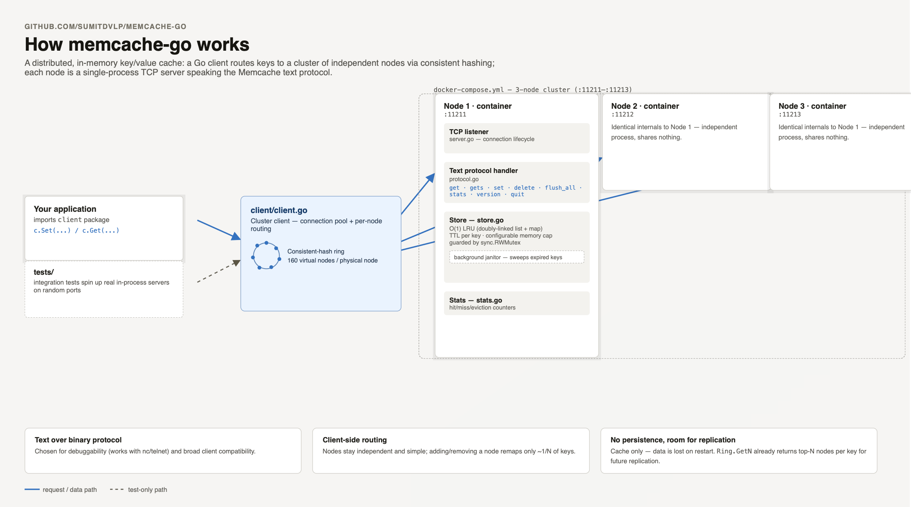

# memcache-go

A distributed Memcache clone written in Go. It provides an in-memory,
LRU-evicting, TTL-aware key/value server that speaks the Memcache **text
protocol**, plus a consistent-hashing client for routing keys across a
multi-node cluster. Deployable as Docker containers.



## Features

- In-memory store with **O(1) LRU eviction** (doubly-linked list + map)
- **TTL** expiration with a background janitor
- Configurable **memory limit** with automatic eviction
- Thread-safe (`sync.RWMutex`)
- Memcache **text protocol**: `get`, `gets`, `set`, `delete`, `flush_all`,
  `stats`, `version`, `quit` — compatible with `nc`, `telnet`, and existing
  memcached clients
- **Consistent hashing** with 160 virtual nodes per physical node for balanced
  distribution and minimal key movement when nodes join/leave
- **Cluster client** with connection pooling and per-node routing
- **Docker** + **docker-compose** for a local 3-node cluster

## Project layout

```
memcache-go/
├── cmd/server/main.go   # server entrypoint (flags/env config)
├── memcache/            # single-node server
│   ├── store.go         # LRU + TTL store
│   ├── protocol.go      # text protocol handler
│   ├── server.go        # TCP listener / lifecycle
│   └── stats.go         # counters
├── cluster/             # consistent hashing
│   ├── hash.go          # hash function
│   └── ring.go          # hash ring with virtual nodes
├── client/client.go     # multi-node routing client
├── docker/Dockerfile
├── docker-compose.yml   # 3-node cluster
└── tests/               # unit + integration tests
```

## Build & run (local)

```sh
# Build
go build ./...

# Run a single node on :11211 with a 64 MiB cap
go run ./cmd/server --addr :11211 --max-mb 64
```

Configuration can also come from environment variables:

- `MEMCACHE_ADDR` (default `:11211`)
- `MEMCACHE_MAX_MB` (default `64`; `0` = unbounded)

## Try it with `nc`

```sh
printf 'set foo 0 0 3\r\nbar\r\n' | nc localhost 11211   # STORED
printf 'get foo\r\n'             | nc localhost 11211   # VALUE foo 0 3 / bar / END
printf 'stats\r\n'              | nc localhost 11211   # STAT ...
```

## Multi-node cluster with Docker

```sh
# Build the image and start 3 nodes (ports 11211, 11212, 11213)
docker compose up --build

# Stop
docker compose down
```

Each container runs an independent node. Key distribution happens **client
side** via consistent hashing — the same design memcached itself uses.

## Using the cluster client

```go
package main

import (
	"fmt"

	"github.com/kusu/memcache-go/client"
)

func main() {
	c := client.New("localhost:11211", "localhost:11212", "localhost:11213")
	defer c.Close()

	_ = c.Set(&client.Item{Key: "user:1", Value: []byte("alice"), Expiration: 60})

	item, err := c.Get("user:1")
	if err != nil {
		panic(err)
	}
	fmt.Printf("%s = %s\n", item.Key, item.Value)
}
```

The client hashes each key to pick a node, so `user:1` always lands on the same
server. Adding or removing a node only remaps roughly `1/N` of keys.

## Testing

```sh
go test ./...          # unit + integration tests
go test -race ./...    # with the race detector
go vet ./...
```

The integration tests start real in-process servers on random ports and drive
them through the cluster client.

## Design notes

- **Text vs. binary protocol**: the text protocol was chosen for easy debugging
  (`nc`/`telnet`) and broad client compatibility.
- **Consistent hashing**: routing lives in the client. Nodes are independent and
  share nothing, keeping the server simple and horizontally scalable.
- **No persistence**: like memcached, this is a cache — data is lost on restart.
- **Replication**: `Ring.GetN` returns the top-N nodes for a key, providing a
  foundation for future replication/failover.
